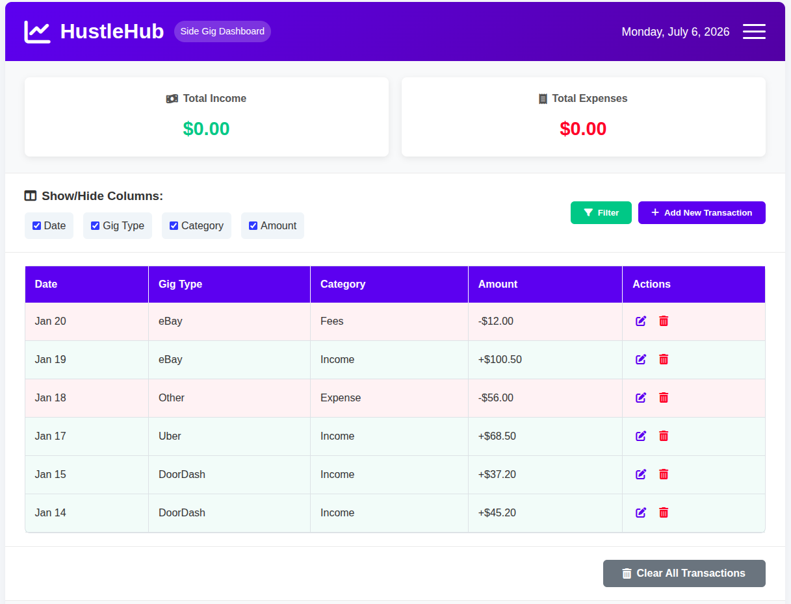

# HustleHub 

A web dashboard that helps gig workers, freelancers, and side-hustlers log income and expenses in one place — built with a human-centered design approach so it's simple and accessible for non-technical users.

## Overview
Managing money across multiple gigs (rideshare, freelance work, side businesses, etc.) is often scattered across notes apps, spreadsheets, or memory. HustleHub was built as a course project for Human-Centered Programming to solve this: a single place to log income and expenses and get a clear picture of overall earnings.

## Objective
Design and build a tool that makes financial tracking approachable for gig workers who may not have a finance or tech background — prioritizing clarity, ease of use, and accessibility over complexity.

## Features
- Log income and expenses from multiple gigs/sources
- Categorization expenses
- Filter data
- Get a graph view of all your expenses (montly, weekly, daily)

## Team Project
Built collaboratively as part of a Human-Centered Programming course.

## Tech Stack
- JavaScript
- HTML
- CSS

## Human-Centered Design Process
- Prioritized accessibility so the tool works for a broad range of users, including those relying on assistive technology

## Getting Started
```bash
git clone https://github.com/georgina-01/HustleHub.git
cd HustleHub
# open index.html in your browser
```

##  Preview


## What We Learned
- Practiced applying accessibility standards (WCAG) in a real front-end project.
- Collaborated on a shared codebase using Git for version control.
